# OceanAcousticsModelling
This collection of modules is an implementation of a ocean acoustics modelling theory.

This repository is now for display only, and is not being developed further. The author is developing a niche package in Julia [here](https://github.com/kapple19/OceanAcoustics.jl).

## Bottom Acoustic Loss
The bottom loss is dependent on the complex-valued sound speed which includes the attenuation in its imaginary component.

The following bottom loss curves are a replication of Figure 1.23 in Jensen et al [[1]](#JensenEtAl).

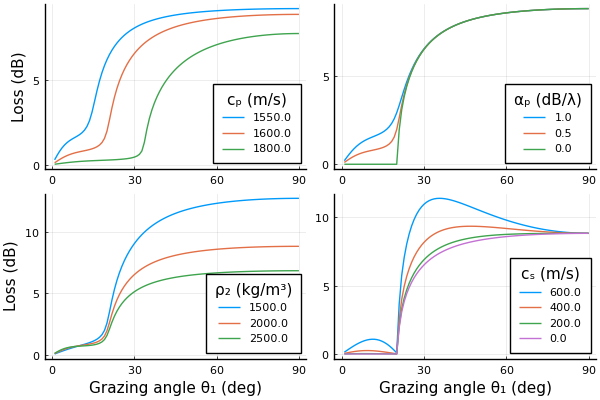

Also replicated here are the bottom loss curves for various sediment types, Figure 1.24 of Jensen [[1]](#JensenEtAl).

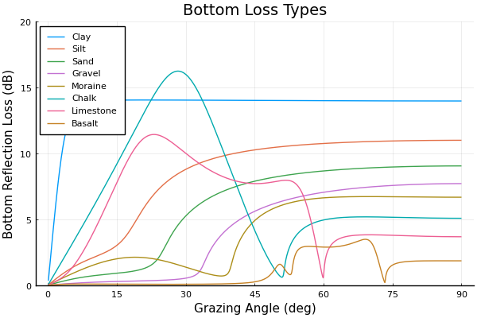

## Acoustic Ray Tracing
The Eikonal equation is solved using Julia's [DifferentialEquations.jl](https://github.com/SciML/DifferentialEquations.jl) [[3]](#RackauckasEtAl) using the time variable in the solvers for the arc-length. Such solver package permits function inputs for the environmental features. The ray tracing is implemented such that any gridded inputs are incorporated as interpolating functions which are passed to the solver.

### Smooth Boundaries
This first example demonstrates a Gaussian bathymetry and sinusoidal altimetry, inputted as functions. The sound speed profile is also range-dependent as a parabola with maximums at the ocean boundaries, which shifts with the changing boundary depths.

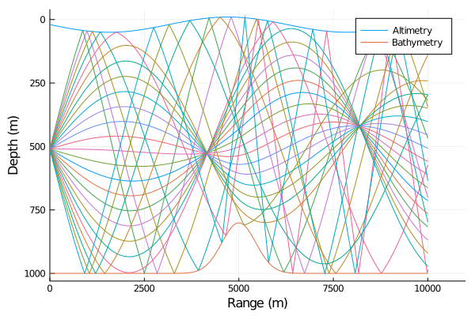

### Parabolic Bathymetry
With a parabolic bathymetry, a source can be placed at the focus of the parabola which yields horizontal rays upon reflection. The following plot is a replication of Figure 3.24a of Jensen [[1]](#JensenEtAl).

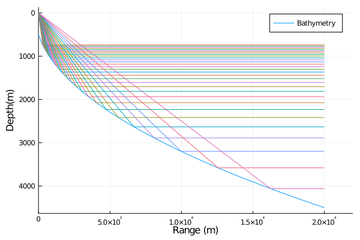

### Upward Refracting Rays
A simple environment with a linearly increasing sound speed with depth yields upward refracting rays.

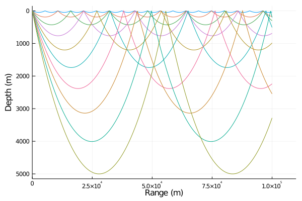

### Convergence Zones
Certain sound speed profiles in the ocean yield rays that group together and return to the surface in ranged intervals. This is a replication of Figure 1.10a in Jensen [[1]](#JensenEtAl).

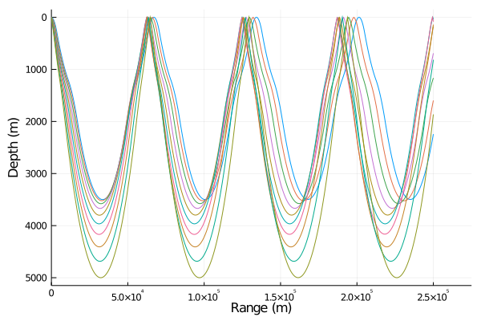

## Sound Field
Of practical interest is the computation of sound fields in the ocean. In many theories, such calculations are built on the ray theory with forms of interpolation such as beam theory.

### Lloyd's Mirror
For the simplified ocean scenario of a constant sound speed with flat altimetry and bathymetry, the mathematics is greatly simplified yet instructively powerful in understanding the phenomenon.

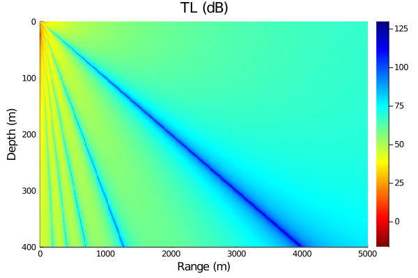

The following plot of a slice through depth is a replication of Figure 1.9 in Jensen [[1]](#JensenEtAl).

## Receiver Operating Characteristic Curves
Receiver operating charactistics (ROC) curves illustrate the relationship between the probabilities of detection and false alarm in detection theory. The theory is taken from Lurton [[2]](#Lurton).

### Gaussian
The ROC curves for a Gaussian-distributed noise and non-fluctuating signal are here plotted as a replication of Figure 6.22 (top) in Lurton [[2]](#Lurton).

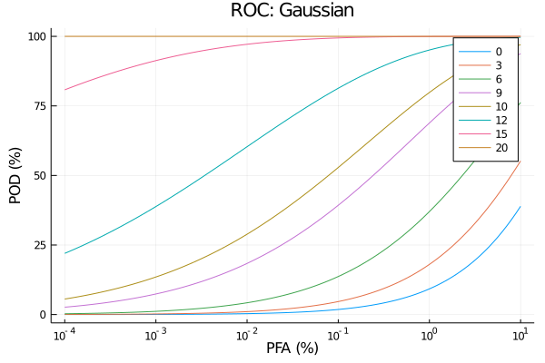

### Exponential
For exponentially distributed noise with non-fluctuating signal, Figure 6.22 (bottom) of Lurton [[2]](#Lurton) is replicated.

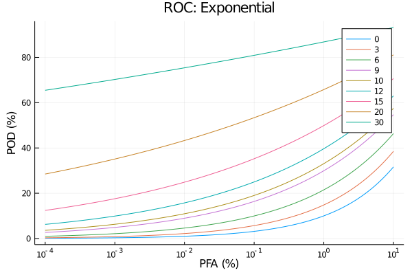

### Rayleigh
For Rayleigh distributed noise with non-fluctuating signal, Figure 6.22 (center) of Lurton [[2]](#Lurton) is replicated.

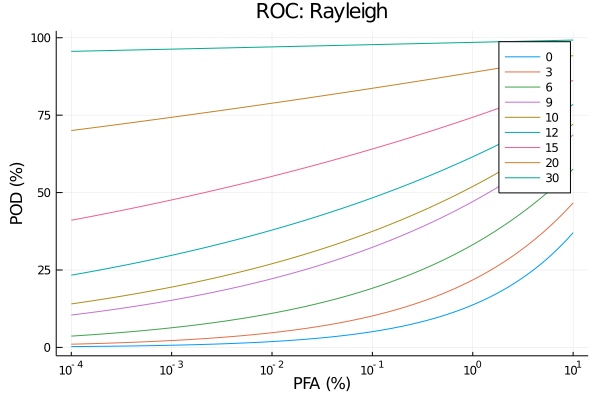

## Sonar Equations
### Simple Propagation
For simple ocean propagation with completely absorbing ocean boundaries (just as a simple demonstration), the following plot shows the detection index, the transmission loss, the signal excess and the probability of detection assuming Gaussian noise.

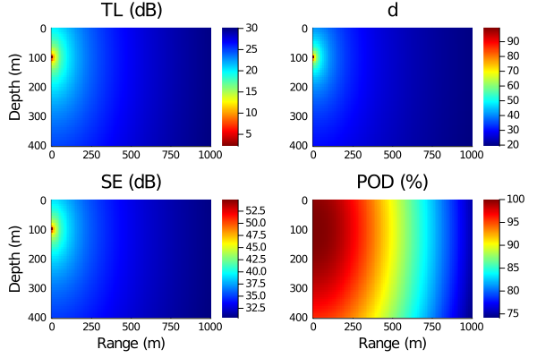

### Lloyd's Mirror
For the single-reflection Lloyd's Mirror interference effect, the same ocean and sonar parameters are displayed.

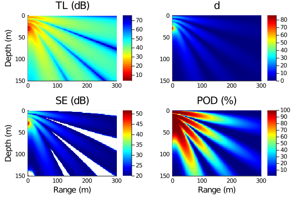

## References
> <a name="JensenEtAl">[1]</a> Jensen, F. B., Kuperman, W. A., Porter, M. B., & Schmidt, H. (2011). Computational ocean acoustics. Springer Science & Business Media.

> <a name="Lurton">[2]</a> Lurton, X., & Leviandier, L. (2010). Underwater acoustic wave propagation, An Introduction to Underwater Acoustics: Principles and Applications.

> <a name="RackauckasEtAl">[3]</a> Rackauckas, C., & Nie, Q. (2017). Differentialequations. jl–a performant and feature-rich ecosystem for solving differential equations in julia. Journal of Open Research Software, 5(1).
