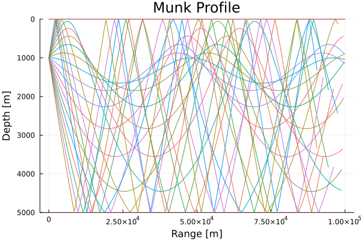
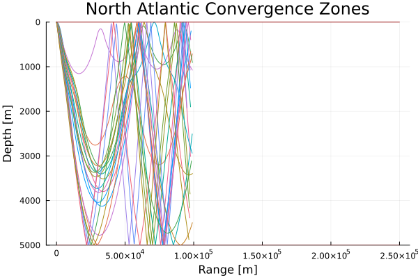
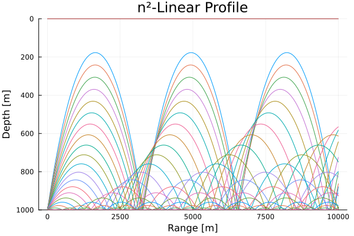
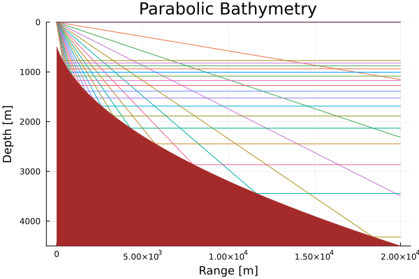
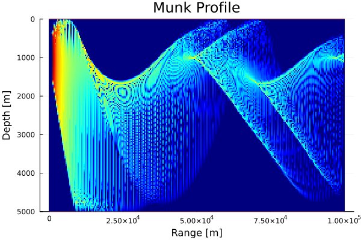
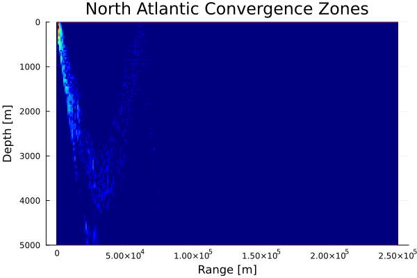
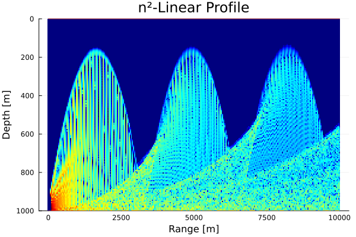
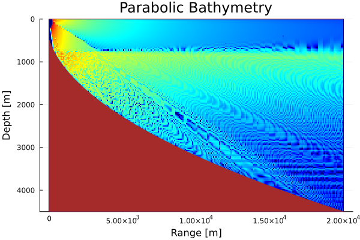

# OceanAcoustics
A personal project, unregistered Julia package. An implementation of acoustics models in the context of long-range ocean propagation.

## Gaussian Beam Method
### Ray Trace

### Propagation Loss

## Parabolic Equation Method
Upcoming.

## Sonar Equations
Upcoming.

### Signal-to-Noise Ratio

### Signal Excess

### Figure of Merit

### Probability of Detection

## References
> [1] Jensen, F. B., Kuperman, W. A., Porter, M. B., & Schmidt, H. (2011). Computational ocean acoustics. Springer Science & Business Media.

> [2] Abraham, D. A. (2019). Underwater Acoustic Signal Processing: Modeling, Detection, and Estimation. Springer.

> [3] Rackauckas, C., & Nie, Q. (2017). Differentialequations. jl–a performant and feature-rich ecosystem for solving differential equations in julia. Journal of Open Research Software, 5(1).

## Development Roadmap
### Epics
* Models:
  * Ray/beam tracing (in dev)
  * Parabolic equation
  * Sonar equations (in dev)
* Auxiliary:
  * Example scenarios (in dev)
  * Plot recipes (in dev)

### Tasks
Dependency-ordered tasks:
* Implement boundary losses.
* Improve existing plot recipes:
  * Create celerity plot beside propagation plot.
  * Layer celerity profile over scenario plot.
* Implement gridded field approximation, then define plot recipe.
  * Coherent and Incoherent beam summations.
* LaTeX document: Mathematics.
* Julia document: Implementation.
  * Document model features, comparing with and referencing literature.
  * Give background and applications.
* Document sonar equations.
  * Extend boundary reflection callbacks: store bounce information in external vector? Is this needed?

Side tasks:
* Improve default launch angle computation.
  * Incorporate initial boundary gradient.
  * Filter 0 degree ray launch angle via celerity derivative and boundary gradient at source.
* Replace range usage `r` with `x`? Research.
* Docstrings and comments in the source code.
  * References. E.g. Jensen for ray reflection.
* Ray colouring options:
  * Trapping.
  * Angle magnitude.
  * Angle sign.
* Implement more example `Scenario`s.
  * Balearic sea [Jensen et al. p 171]
* Implement more tests.