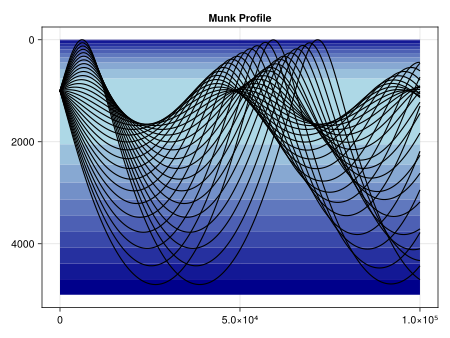

# OceanSonar

[](https://gitlab.com/aaronjkaw/OceanSonar.jl/pipelines)
[](https://gitlab.com/aaronjkaw/OceanSonar.jl/commits/main)
[](https://github.com/JuliaTesting/Aqua.jl)

## Why This Package?

Because all of the following is produced and experienced in one programming language.

### Differential Equation Solving

#### Ray Tracing

Fig 3.32 of Jensen, et al (2011).



#### Acoustic Propagation


#### Automatic Differentiation

TODO.

### Scaling and Performance

#### Parallel Computing

TODO.

#### GPU Computing

TODO.

### Ease of Development

#### Legibility

TODO.

#### Simple yet Powerful Testing Syntax

TODO.

#### Property-Based Testing

With `PropCheck.jl`.

TODO.

#### Profiling and Allocation Hunting

All within Visual Studio Code.

### Modularity of Models

#### Ocean Features

TODO.

#### Ocean Sonar Performance Metrics

TODO.

#### User Extensibility

TODO.

### Reproducibility

#### ...of Package Results

Via Julia's package manager.

TODO.

#### ...of Literature

TODO.

Insert Ref

## Citing

See [`citation.bib`](citation.bib) for the relevant reference(s).

## On the Shoulders of Giants

## Academic

> Abraham, D. A. (2019). _Underwater Acoustic Signal Processing: Modeling, Detection, and Estimation_. Springer.

> Ainslie, M. A. (2010). _Principles of Sonar Performance Modelling_. Springer.

> Jensen, F. B., Kuperman, W. A., Porter, M. B., & Schmidt, H. (2011). _Computational Ocean Acoustics_ (2nd Ed.). Springer.

> Lurton, X. (2016). _An Introduction to Underwater Acoustics: Principles and Applications_ (2nd Ed.). Springer.

## Software

No references:

* [Documenter.jl](https://github.com/JuliaDocs/Documenter.jl)
* [LiveServer.jl](https://github.com/tlienart/LiveServer.jl)
* [Aqua.jl](https://github.com/JuliaTesting/Aqua.jl)
* [JET.jl](https://github.com/aviatesk/JET.jl)
* [PropCheck.jl](https://github.com/Seelengrab/PropCheck.jl)

```bibtex
@article{Julia-2017,
    title={Julia: A fresh approach to numerical computing},
    author={Bezanson, Jeff and Edelman, Alan and Karpinski, Stefan and Shah, Viral B},
    journal={SIAM {R}eview},
    volume={59},
    number={1},
    pages={65--98},
    year={2017},
    publisher={SIAM},
    doi={10.1137/141000671},
    url={https://epubs.siam.org/doi/10.1137/141000671}
}
```

```bibtex
@article{RevelsLubinPapamarkou2016,
    title = {Forward-Mode Automatic Differentiation in {J}ulia},
    author = {{Revels}, J. and {Lubin}, M. and {Papamarkou}, T.},
    journal = {arXiv:1607.07892 [cs.MS]},
    year = {2016},
    url = {https://arxiv.org/abs/1607.07892}
}
```

```bibtex
@software{IntervalArithmetic.jl,
    author = {David P. Sanders and Luis Benet},
    title  = {IntervalArithmetic.jl},
    url    = {https://github.com/JuliaIntervals/IntervalArithmetic.jl},
    year   = {2014},
    doi    = {10.5281/zenodo.3336308}
}
```

```bibtex
@article{DanischKrumbiegel2021,
    doi = {10.21105/joss.03349},
    url = {https://doi.org/10.21105/joss.03349},
    year = {2021},
    publisher = {The Open Journal},
    volume = {6},
    number = {65},
    pages = {3349},
    author = {Simon Danisch and Julius Krumbiegel},
    title = {{Makie.jl}: Flexible high-performance data visualization for {Julia}},
    journal = {Journal of Open Source Software}
}
```

```bibtex
@article{DifferentialEquations.jl-2017,
    author = {Rackauckas, Christopher and Nie, Qing},
    doi = {10.5334/jors.151},
    journal = {The Journal of Open Research Software},
    keywords = {Applied Mathematics},
    note = {Exported from https://app.dimensions.ai on 2019/05/05},
    number = {1},
    pages = {},
    title = {DifferentialEquations.jl – A Performant and Feature-Rich Ecosystem for Solving Differential Equations in Julia},
    url = {https://app.dimensions.ai/details/publication/pub.1085583166 and http://openresearchsoftware.metajnl.com/articles/10.5334/jors.151/galley/245/download/},
    volume = {5},
    year = {2017}
}
```
