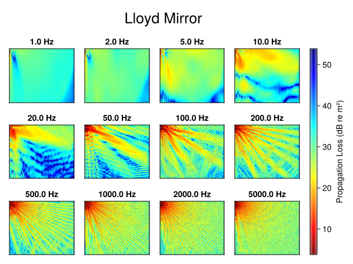

# OceanSonar.jl

[](https://kapple19.github.io/OceanSonar.jl/stable/)
[](https://kapple19.github.io/OceanSonar.jl/dev/)
[](https://github.com/kapple19/OceanSonar.jl/actions/workflows/CI.yml?query=branch%3Amain)
[](https://github.com/JuliaTesting/Aqua.jl)

[Aqua.jl]: https://docs.juliahub.com/Aqua
[Documenter.jl]: https://documenter.juliadocs.org/stable
[JET.jl]: https://aviatesk.github.io/JET.jl
[Julia]: https://docs.julialang.org/en
[Latexify.jl]: https://korsbo.github.io/Latexify.jl/stable
[LiveServer.jl]: https://tlienart.github.io/LiveServer.jl
[Makie.jl]: https://docs.makie.org/stable/
[ModelingToolkit.jl]: https://docs.sciml.ai/ModelingToolkit/stable
[Plots.jl]: https://docs.juliaplots.org/stable
[PropCheck.jl]: https://seelengrab.github.io/PropCheck.jl/stable
[Symbolics.jl]: https://docs.sciml.ai/Symbolics/stable

This [Julia] package is in development.

The purpose of this package is to implement ocean acoustics and sonar models.
Its goal is an open source community-developed acoustics package that enables:

* Performance like C++ and Fortran with legible syntax like MATLAB and Python.
* Distributed and parallel computing provided by Julia.
* Reproducibility of literature books and papers.
* Composability and modularity of models.
* Documented verbosities of mathematical results.
* Ease of collaboration.
* Code implementations that can be introspected mathematically, compiler-wise, and visualisation functionalities are built-in.
* Reliance and use of community-developed and tested equation solver libraries for differential equations, root finders, etc.

Motivations of the primary author:

* Mastery of field.
* Community engagement.
* Julia programming enjoyment and learning.
* Demonstration of Julia as next generation scientific software tool for analysis and deployment.

## Usage

Installation requires the [Julia] programming language.

This package is still under development,
thus the repository address is required for installation.

1. Install Julia using the instructions [here](https://julialang.org/downloads/).
2. Open a Julia REPL (terminal).
3. Activate the `Pkg` mode by pressing `]`.
4. Enter `add https://github.com/kapple19/OceanSonar.jl` which installs the `OceanSonar.jl` package.
5. Return to the `Julian` mode by backspacing.
6. Enter `using OceanSonar`.

## Demonstration

Acoustic ray tracing

```julia
using OceanSonar
using CairoMakie

scen = Scenario("Munk Profile")
prop = Propagation("Trace", scen, angles = critical_angles(scen, N = 21))

visual(Beam, prop)
```


```julia
using OceanSonar
using CairoMakie

scen = Scenario("Parabolic Bathymetry")
lowest_angle = atan(1, 5)
highest_angle = atan(5, 2)
angles = angles = range(lowest_angle, highest_angle, 31)
prop = Propagation("Trace", scen, angles = angles)

visual(Beam, prop)
```


Visualise frequency changes (issues with CairoMakie image saving)

```julia
using OceanSonar
using CairoMakie
using Statistics

model = "Lloyd Mirror"

function run_prop(f)
    scen = Scenario(model)
    scen.f = f
    return Propagation("Trace", scen)
end

props = [run_prop(f) for f in series125(5e3)]

bounds(data) = mean(data) .+ (3std(data) * [-1, 1])
clims = [prop.PL for prop in props] |> splat(vcat) |> bounds

fig = Figure()
num_rows, num_cols = OceanSonar.rect_or_square_gridsize(props |> length)
heatmaps = Makie.Plot[]
for row in 1:num_rows, col in 1:num_cols
    lin = LinearIndices((num_cols, num_rows))

    idx_prop = lin[col, row]
    prop = props[idx_prop]

    pos = fig[row, col]
    axis = Axis(pos,
        yreversed = true,
        title = string(prop.scen.f, " Hz")
    )
    hidedecorations!(axis)

    hm = heatmap!(axis,
        prop,
        colormap = Reverse(:jet),
        colorrange = clims,
        interpolate = true # https://github.com/MakieOrg/Makie.jl/issues/2514
    )
    push!(heatmaps, hm)
end
Colorbar(fig[:, end+1], heatmaps[1],
    label = OceanSonar.label(Propagation)
)
Label(fig[0, :], model,
    fontsize = 25
)

fig
```



Compare square root operator approximations for the parabolic equation

```julia
using OceanSonar
using CairoMakie

scen = Scenario("Lloyd Mirror")
config = ParabolicConfig()
for model = list_models(RationalFunctionApproximation)
    # config.marcher = marcher
    # prop = Propagation(config, scen)
    # visual!(prop) # TODO: tile
end

nothing
```

In development.

Visualise the equation for an OceanSonar.jl model

```julia
using OceanSonar
using Symbolics

@variables x z
ocean_celerity("Munk", x, z) |> string
```

1500(1 + 0.00737(-1 + 2(-1 + (1//1300)*z) + exp(-2(-1 + (1//1300)*z))))
## Implementation & Roadmap Summary

* Sonar oceanography
  * Conceptually-structured hierarchical containers
  * Convenience uni/multivariate interpolators
  * Inbuilt extensive suite of environments from literature

* Underwater acoustics
  * Reflection dynamics and losses
  * Scattering and reverberation
  * Propagation solution methods
    * Ray methods
    * Wavenumber integration
    * Normal modes
    * Parabolic equations
    * Finite difference and finite element methods
  * Replication of literature results

* Signal processing
  * Sonar types hierarchy enumeration
  * Efficiently implemented sonar type-sensitive sonar equation term calculations

* Statistical detection theory
  * ROC curves
  * Signal detector design
  * Detection metrics e.g. signal excess, transition detection probability, etc.

* Documentation
  * Book publishing of ocean sonar theory with executable, reproducible implementation examples
  * Mathematical formulations accompany implementation, reducing vagueness
  * Pushing frontiers of ocean acoustics and sonar with reproducible publications

* Computational performance
  * Removing allocations
  * Parallel and distributed computing

* Front-end compatibility
  * [ModelingToolkit.jl] compatibility
  * Ocean sonar GUI

## Citation

Cite this work with [`citation.bib`](citation.bib):

```verbatim
@misc{OceanSonar.jl,
    author  = {Aaron Kaw <aaronjkaw@gmail.com> and contributors},
    title   = {OceanSonar.jl},
    url     = {https://github.com/kapple19/OceanSonar.jl},
    version = {v1.0.0-DEV},
    year    = {2024},
    month   = {3}
}
```

### Academic Bibliography

> Abraham, D. A. (2019). _Underwater Acoustic Signal Processing: Modeling, Detection, and Estimation_. Springer.

> Ainslie, M. A. (2010). _Principles of Sonar Performance Modelling_. Springer.

> Jensen, F. B., Kuperman, W. A., Porter, M. B., & Schmidt, H. (2011). _Computational Ocean Acoustics_ (2nd Ed.). Springer.

> Lurton, X. (2016). _An Introduction to Underwater Acoustics: Principles and Applications_ (2nd Ed.). Springer.

### Software Bibliography

No citation provided:

* [Aqua.jl]
* [Documenter.jl]
* [JET.jl]
* [Latexify.jl]
* [LiveServer.jl]
* [PropCheck.jl]

Provided citations:

```bibtex
@article{DifferentialEquations.jl-2017,
    author = {Rackauckas, Christopher and Nie, Qing},
    doi = {10.5334/jors.151},
    journal = {The Journal of Open Research Software},
    keywords = {Applied Mathematics},
    note = {Exported from https://app.dimensions.ai on 2019/05/05},
    number = {1},
    pages = {},
    title = {DifferentialEquations.jl – A Performant and Feature-Rich Ecosystem for Solving Differential Equations in Julia},
    url = {https://app.dimensions.ai/details/publication/pub.1085583166 and http://openresearchsoftware.metajnl.com/articles/10.5334/jors.151/galley/245/download/},
    volume = {5},
    year = {2017}
}
```

```bibtex
@article{RevelsLubinPapamarkou2016,
    title = {Forward-Mode Automatic Differentiation in {J}ulia},
    author = {{Revels}, J. and {Lubin}, M. and {Papamarkou}, T.},
    journal = {arXiv:1607.07892 [cs.MS]},
    year = {2016},
    url = {https://arxiv.org/abs/1607.07892}
}
```

```bibtex
@software{IntervalArithmetic.jl,
    author = {David P. Sanders and Luis Benet},
    title  = {IntervalArithmetic.jl},
    url    = {https://github.com/JuliaIntervals/IntervalArithmetic.jl},
    year   = {2014},
    doi    = {10.5281/zenodo.3336308}
}
```

```bibtex
@article{Julia-2017,
    title={Julia: A fresh approach to numerical computing},
    author={Bezanson, Jeff and Edelman, Alan and Karpinski, Stefan and Shah, Viral B},
    journal={SIAM {R}eview},
    volume={59},
    number={1},
    pages={65--98},
    year={2017},
    publisher={SIAM},
    doi={10.1137/141000671},
    url={https://epubs.siam.org/doi/10.1137/141000671}
}
```

```bibtex
@misc{ma2021modelingtoolkit,
    title={ModelingToolkit: A Composable Graph Transformation System For Equation-Based Modeling},
    author={Yingbo Ma and Shashi Gowda and Ranjan Anantharaman and Chris Laughman and Viral Shah and Chris Rackauckas},
    year={2021},
    eprint={2103.05244},
    archivePrefix={arXiv},
    primaryClass={cs.MS}
}
```

```bibtex
@article{PlotsJL,
    doi = {https://doi.org/10.5334/jors.431},
    url = {https://openresearchsoftware.metajnl.com/articles/10.5334/jors.431/},
    author = {Christ, Simon and Schwabeneder, Daniel and Rackauckas, Christopher and Borregaard, Michael Krabbe and Breloff, Thomas},
    keywords = {Graphics (cs.GR), FOS: Computer and information sciences, FOS: Computer and information sciences, I.3.3},
    title = {Plots.jl -- a user extendable plotting API for the julia programming language},
    publisher = {Journal of Open Research Software},
    year = {2023},
    copyright = {Creative Commons Attribution 4.0 International}
}
```
